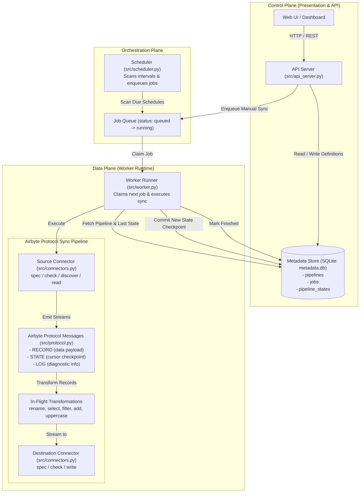

# etl: Airbyte-Inspired Local Data Integration Platform

A reverse-engineered, lightweight local data integration platform mirroring the architecture and protocol of [Airbyte](https://github.com/airbytehq/airbyte). Features a dedicated API server, worker execution engine, scheduler, Airbyte protocol messages (`RECORD`, `STATE`, `LOG`, `SPEC`), incremental cursor syncs, state checkpointing, and browser UI.

---

## 🏗️ Architecture & Reverse Engineering

Airbyte decouples the **Control Plane** (Webapp, REST API Server, Config/Job Database) from the **Data Plane** (Temporal orchestrator, Worker runtime, ephemeral Source & Destination connector containers). This platform implements these exact core principles:



---

## ⚙️ Core Airbyte Features Implemented

### 1. Airbyte Protocol (`src/protocol.py`)
Standardized message schema for inter-process and stream communication:
- `AirbyteMessage`: Encapsulates message types (`RECORD`, `STATE`, `LOG`, `SPEC`, `CONNECTION_STATUS`).
- `AirbyteRecordMessage`: Emits streaming data rows with stream name and timestamp.
- `AirbyteStateMessage`: Checkpoints cursor offsets (e.g. `timestamp`, `id`, `updated_at`).
- `AirbyteLogMessage`: Emits live structured logs to job history.

### 2. Sync Modes
- **Full Refresh (Overwrite)**: Truncates destination table/file and loads all records.
- **Full Refresh (Append)**: Appends all emitted records.
- **Incremental (Append)**: Only reads records where `cursor_field > last_checkpoint`.
- **Incremental (Deduped / Upsert)**: Emits new/updated records and performs `INSERT OR REPLACE` using the pipeline `primary_key`.

### 3. Connector Lifecycle APIs
Complies with standard Airbyte connector commands:
- `spec`: Retrieve JSON schema configuration requirements.
- `check`: Validate connectivity and credentials.
- `discover`: Introspect source schema and streams.
- `read`: Extract records and emit state checkpoints.
- `write`: Consume records into destination storage.

---

## 🔌 Supported Connectors

### Source Connectors
- `inline_json`: JSON records embedded directly in configuration.
- `csv_file`: CSV files with configurable delimiter, encoding, and header options.
- `http_json`: External or internal REST API endpoints.

### Destination Connectors
- `sqlite_file`: Relational SQLite database with automatic type inference, primary keys, and replace/append/upsert modes.
- `jsonl_file`: High-performance newline-delimited JSON log files.

### In-Flight Transformations
- `rename_fields`: Renames keys using dictionary mapping.
- `select_fields`: Projects specific whitelist of columns.
- `filter_equals`: Filters rows matching target value.
- `add_fields`: Appends static metadata / tags to rows.
- `uppercase_fields`: Converts string columns to uppercase.

---

## 🚀 Local Run Modes

Run all components (API, embedded Worker, and Scheduler) in one process:
```bash
python app.py
```

Or run dedicated microservices:
```bash
python app.py api        # API Server only
python app.py worker     # Worker queue consumer only
python app.py scheduler  # Schedule scanner only
```
Open **`http://127.0.0.1:8000`** in your browser.

### Docker Compose
```bash
docker compose up --build
```

---

## 🧪 Testing

Run the full automated test suite:
```bash
python3 -m unittest discover -s tests -v
```

All 12 test suites cover:
- Async worker job execution and scheduling
- Airbyte Protocol message serialization and deserialization
- Incremental sync with cursor filtering and state checkpointing
- State inspection and state reset APIs
- Connector lifecycle endpoints (`spec`, `check`, `discover`)
- Safe storage sandboxing and symlink prevention

---

## 📡 API Reference

| Method | Endpoint | Description |
|---|---|---|
| `GET` | `/api/health` | Service healthcheck |
| `GET` | `/api/dashboard` | Metric counters (pipelines, jobs, active workers) |
| `GET` | `/api/connectors` | Connector catalog (sources, destinations, transformations) |
| `GET` | `/api/connectors/source/<name>/spec` | Source configuration schema |
| `POST` | `/api/connectors/source/<name>/check` | Test source connection |
| `POST` | `/api/connectors/source/<name>/discover` | Introspect source streams & fields |
| `GET` | `/api/connectors/destination/<name>/spec` | Destination configuration schema |
| `POST` | `/api/connectors/destination/<name>/check` | Test destination connection |
| `GET` | `/api/pipelines` | List configured pipelines |
| `POST` | `/api/pipelines` | Create pipeline |
| `GET` | `/api/pipelines/<id>` | Fetch pipeline details |
| `DELETE` | `/api/pipelines/<id>` | Delete pipeline and state |
| `POST` | `/api/pipelines/<id>/run` | Enqueue a sync job |
| `POST` | `/api/pipelines/<id>/preview` | Preview sync run output |
| `GET` | `/api/pipelines/<id>/state` | View current incremental state cursor |
| `POST` | `/api/pipelines/<id>/state/reset` | Reset state cursor (trigger full sync) |
| `GET` | `/api/jobs` | List job history and logs |
| `GET` | `/api/jobs/<id>` | Fetch specific job details |
| `POST` | `/api/files` | Upload/save file to platform storage |

---

## 📋 Example: Incremental Pipeline Payload

```json
{
  "name": "incremental-contacts-sync",
  "enabled": true,
  "sync_mode": "incremental",
  "cursor_field": "id",
  "primary_key": "id",
  "schedule_interval_seconds": 300,
  "source": {
    "type": "http_json",
    "config": {
      "url": "http://127.0.0.1:8000/api/demo/contacts",
      "records_key": "records",
      "timeout_seconds": 10
    }
  },
  "transformations": [
    {
      "type": "rename_fields",
      "config": {
        "mapping": {
          "email": "email_address"
        }
      }
    },
    {
      "type": "uppercase_fields",
      "config": {
        "fields": ["country"]
      }
    }
  ],
  "destination": {
    "type": "sqlite_file",
    "config": {
      "path": "warehouse/contacts.db",
      "table": "contacts"
    }
  }
}
```

